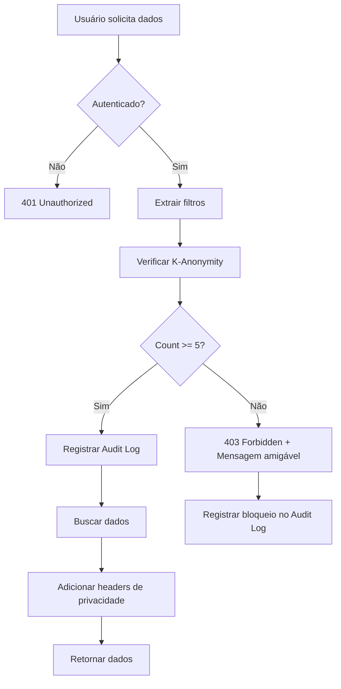

# K-Anonymity e Conformidade LGPD no VIVAMENTE360

## Índice

1. [Visão Geral](#visão-geral)
2. [K-Anonymity: Conceito e Implementação](#k-anonymity-conceito-e-implementação)
3. [Conformidade LGPD](#conformidade-lgpd)
4. [Arquitetura de Proteção](#arquitetura-de-proteção)
5. [Guia de Uso](#guia-de-uso)
6. [Scripts e Manutenção](#scripts-e-manutenção)
7. [Testes](#testes)
8. [FAQ](#faq)

---

## Visão Geral

O VIVAMENTE360 implementa proteções robustas de privacidade e dados pessoais em conformidade com a **Lei Geral de Proteção de Dados (LGPD - Lei 13.709/2018)** e melhores práticas internacionais.

### Principais Características

- **K-Anonymity (K=5)**: Dados agregados só são exibidos quando há no mínimo 5 respondentes
- **Consentimento LGPD**: Coleta explícita de consentimento com metadados completos
- **Audit Logs**: Rastreamento completo de acessos a dados pessoais
- **Política de Retenção**: Dados mantidos por 5 anos (conforme legislação trabalhista)
- **Direitos do Titular**: Interface completa para exercício de direitos LGPD
- **Anonimização Automática**: Expurgo de dados após período de retenção

---

## K-Anonymity: Conceito e Implementação

### O que é K-Anonymity?

K-Anonymity é um conceito de privacidade que garante que cada registro em um dataset não pode ser distinguido de pelo menos **K-1** outros registros. No VIVAMENTE360, usamos **K=5**, o que significa:

> "Seus dados só são exibidos em relatórios quando há pelo menos **5 respondentes** no grupo analisado."

### Por que K=5?

- **Padrão da Indústria**: K=5 é amplamente aceito como mínimo para proteção de privacidade
- **Balanceamento**: Equilibra privacidade com utilidade dos dados
- **Conformidade LGPD**: Atende Art. 46 e 49 sobre segurança da informação

### Como Funciona?

```typescript
// Exemplo de verificação K-Anonymity
import { verificarKAnonymity } from '@/lib/k-anonymity';

const resultado = await verificarKAnonymity(empresaId, {
  unidadeId: 'unidade-123',
  setorId: 'setor-456'
});

if (!resultado.passed) {
  // Bloquear acesso aos dados
  return {
    error: 'K_ANONYMITY_NAO_ATENDIDO',
    message: resultado.message
  };
}

// Prosseguir com exibição dos dados
```

### Proteção em Múltiplas Camadas

1. **Nível de Empresa**: Mínimo 5 respondentes na empresa toda
2. **Nível de Unidade**: Mínimo 5 respondentes na unidade filtrada
3. **Nível de Setor**: Mínimo 5 respondentes no setor filtrado
4. **Nível de Cargo**: Mínimo 5 respondentes no cargo filtrado
5. **Combinações**: Filtros combinados também são verificados

### Cenários de Proteção

#### ✅ Permitido (K-Anonymity Atendido)

```
Empresa ABC → 50 respondentes
└─ Unidade SP → 20 respondentes ✅
   └─ Setor TI → 8 respondentes ✅
      └─ Cargo Desenvolvedor → 6 respondentes ✅
```

#### ❌ Bloqueado (K-Anonymity Não Atendido)

```
Empresa XYZ → 12 respondentes
└─ Unidade RJ → 4 respondentes ❌
   └─ Setor Financeiro → 2 respondentes ❌
```

---

## Conformidade LGPD

### Base Legal (LGPD Art. 7)

O tratamento de dados no VIVAMENTE360 é baseado em:

1. **Consentimento** (Art. 7, I): Consentimento explícito do colaborador
2. **Obrigação Legal** (Art. 7, II): NR-1 e legislação trabalhista brasileira
3. **Interesse Legítimo** (Art. 7, IX): Promoção de ambiente de trabalho saudável

### Princípios Implementados

#### 1. Finalidade (Art. 6, I)

```typescript
// Finalidade específica e legítima
const FINALIDADE = {
  principal: 'Avaliar riscos psicossociais no ambiente de trabalho',
  secundaria: 'Gerar relatórios agregados conforme NR-1',
  terciaria: 'Propor melhorias organizacionais'
};
```

#### 2. Adequação (Art. 6, II)

Dados coletados são estritamente necessários para a finalidade:
- Respostas ao questionário HSE-IT
- Dados demográficos básicos (unidade, setor, cargo)
- Consentimento e metadados

#### 3. Necessidade (Art. 6, III)

Limitação ao mínimo necessário:
- **NÃO** coletamos: CPF, endereço, telefone, dados bancários
- **SIM** coletamos: E-mail (para envio do questionário), cargo (para análise organizacional)

#### 4. Transparência (Art. 6, VI)

```typescript
// Informações claras ao titular
<ConsentimentoLGPD>
  <p>Seus dados são coletados para avaliar riscos psicossociais.</p>
  <p>Serão mantidos por 5 anos conforme legislação trabalhista.</p>
  <p>K-Anonymity (K=5) garante que suas respostas individuais não serão identificadas.</p>
</ConsentimentoLGPD>
```

#### 5. Segurança (Art. 6, VII)

- **Criptografia**: PostgreSQL com SSL/TLS
- **Controle de Acesso**: Autenticação NextAuth + RBAC
- **Audit Logs**: Rastreamento completo
- **K-Anonymity**: Proteção estatística

#### 6. Prevenção (Art. 6, VIII)

```typescript
// Medidas preventivas
- Validação de input (Zod)
- Sanitização de dados
- Rate limiting
- HTTPS obrigatório
- Headers de segurança (HSTS, CSP, X-Frame-Options)
```

### Direitos do Titular (Art. 18)

| Direito | Implementação |
|---------|---------------|
| **Confirmação e Acesso** (I, II) | `/lgpd` → Visualizar Meus Dados |
| **Correção** (III) | Contato com RH |
| **Anonimização/Bloqueio** (IV) | Expurgo automático após 5 anos |
| **Portabilidade** (V) | `/lgpd` → Solicitar Portabilidade (JSON/CSV/PDF) |
| **Eliminação** (VI) | `/lgpd` → Solicitar Exclusão |
| **Informação sobre Compartilhamento** (VII) | Documentação completa |
| **Revogação de Consentimento** (IX) | Solicitação via DPO |

---

## Arquitetura de Proteção

### Componentes Principais

```
┌─────────────────────────────────────────────────────┐
│                                                     │
│                   VIVAMENTE360                      │
│            Sistema de Proteção LGPD                 │
│                                                     │
└─────────────────────────────────────────────────────┘
                         │
        ┌────────────────┼────────────────┐
        │                │                │
        ▼                ▼                ▼
┌─────────────┐  ┌─────────────┐  ┌─────────────┐
│ K-Anonymity │  │ Audit Logs  │  │  Retenção   │
│   (K=5)     │  │  Completos  │  │  (5 anos)   │
└─────────────┘  └─────────────┘  └─────────────┘
        │                │                │
        └────────────────┼────────────────┘
                         │
                         ▼
              ┌──────────────────┐
              │   Middleware     │
              │   de Proteção    │
              └──────────────────┘
                         │
        ┌────────────────┼────────────────┐
        │                │                │
        ▼                ▼                ▼
┌─────────────┐  ┌─────────────┐  ┌─────────────┐
│ /api/       │  │ /api/       │  │ /api/       │
│ dashboard   │  │ relatorios  │  │ questionario│
└─────────────┘  └─────────────┘  └─────────────┘
```

### Fluxo de Proteção



### Estrutura de Arquivos

```
lib/
├── k-anonymity.ts              # Verificações K-Anonymity
├── k-anonymity-middleware.ts   # Middleware para APIs
├── audit-log.ts                # Sistema de logs de auditoria
├── data-retention.ts           # Política de retenção
└── authorization.ts            # Controle de acesso

app/
├── api/
│   ├── dashboard/analytics/    # Protected with K-Anonymity
│   ├── relatorios/             # Protected with K-Anonymity
│   └── questionario/submit/    # LGPD consent collection
└── (dashboard)/
    └── lgpd/                   # Interface de direitos do titular

components/
└── lgpd/
    ├── LGPDInfo.tsx            # Informações e documentação
    └── ConsentimentoLGPD.tsx   # Tela de consentimento

scripts/
└── expurgo-dados.ts            # Script de expurgo automático

__tests__/
└── k-anonymity.test.ts         # Testes de proteção
```

---

## Guia de Uso

### Para Desenvolvedores

#### 1. Proteger um Novo Endpoint com K-Anonymity

```typescript
// app/api/novo-endpoint/route.ts
import { NextRequest, NextResponse } from 'next/server';
import { auth } from '@/lib/auth';
import { verificarKAnonymity, getMensagemKAnonymityNaoAtendido } from '@/lib/k-anonymity';
import { registrarVisualizacaoAnalytics } from '@/lib/audit-log';

export async function GET(request: NextRequest) {
  const session = await auth();
  if (!session) return NextResponse.json({ error: 'Unauthorized' }, { status: 401 });

  // Extrair filtros
  const { searchParams } = new URL(request.url);
  const filtros = {
    unidadeId: searchParams.get('unidadeId') || undefined,
    setorId: searchParams.get('setorId') || undefined,
  };

  // Verificar K-Anonymity
  const resultado = await verificarKAnonymity(session.user.empresaId, filtros);

  if (!resultado.passed) {
    await registrarBloqueioKAnonymity(
      session.user.id,
      session.user.empresaId,
      filtros,
      resultado.count,
      resultado.minRequired,
      request.headers.get('x-forwarded-for') || 'unknown'
    );

    return NextResponse.json({
      error: 'K_ANONYMITY_NAO_ATENDIDO',
      message: getMensagemKAnonymityNaoAtendido(resultado.count),
    }, { status: 403 });
  }

  // Registrar acesso
  await registrarVisualizacaoAnalytics(
    session.user.id,
    session.user.empresaId,
    filtros,
    resultado.count,
    request.headers.get('x-forwarded-for') || 'unknown'
  );

  // Buscar e retornar dados
  const dados = await buscarDados(session.user.empresaId, filtros);
  return NextResponse.json(dados);
}
```

#### 2. Usar o Middleware (Abordagem Simplificada)

```typescript
// app/api/protected-endpoint/route.ts
import { comProtecaoKAnonymity } from '@/lib/k-anonymity-middleware';

export const GET = comProtecaoKAnonymity(async (req) => {
  // Dados já foram validados pelo middleware
  // Você pode acessar diretamente
  const dados = await buscarDados();
  return NextResponse.json(dados);
});
```

#### 3. Registrar Ações no Audit Log

```typescript
import {
  registrarAcessoDadosPessoais,
  registrarGeracaoRelatorio,
  registrarExportacaoDados
} from '@/lib/audit-log';

// Acesso a dados pessoais
await registrarAcessoDadosPessoais(
  userId,
  colaboradorId,
  'Visualização de dashboard filtrado',
  ipAddress
);

// Geração de relatório
await registrarGeracaoRelatorio(
  userId,
  'executivo',
  { empresaId, unidadeId },
  'PDF',
  ipAddress
);

// Exportação de dados
await registrarExportacaoDados(
  userId,
  'CSV Colaboradores',
  'COLABORADOR',
  150, // quantidade
  { ativo: true },
  ipAddress
);
```

### Para Administradores

#### Executar Expurgo de Dados

```bash
# Simular expurgo (dry-run) - não faz alterações
npm run expurgo:dry
# ou
tsx scripts/expurgo-dados.ts --dry-run

# Executar expurgo real
npm run expurgo:exec
# ou
tsx scripts/expurgo-dados.ts --force

# Ver estatísticas de retenção
tsx scripts/expurgo-dados.ts --dry-run --verbose
```

#### Configurar Cron Job (Automação)

```bash
# Adicionar ao crontab (executar mensalmente)
0 2 1 * * cd /path/to/vivamente360 && tsx scripts/expurgo-dados.ts --force >> /var/log/expurgo-dados.log 2>&1
```

#### Verificar Logs de Auditoria

```typescript
import { buscarAuditLogs } from '@/lib/audit-log';

// Buscar logs dos últimos 30 dias
const resultado = await buscarAuditLogs({
  action: 'LGPD_DATA_ACCESS',
  dataInicio: new Date('2026-01-01'),
  dataFim: new Date('2026-01-31'),
  limit: 100
});

console.log(`Total de acessos: ${resultado.total}`);
```

---

## Scripts e Manutenção

### Scripts Disponíveis

| Script | Comando | Descrição |
|--------|---------|-----------|
| Expurgo (dry-run) | `npm run expurgo:dry` | Simula expurgo sem fazer alterações |
| Expurgo (real) | `npm run expurgo:exec` | Executa expurgo real de dados |
| Testes | `npm test` | Executa testes de K-Anonymity |

### Manutenção Recomendada

#### Mensal
- ✅ Executar expurgo de dados (`npm run expurgo:exec`)
- ✅ Revisar logs de auditoria
- ✅ Verificar estatísticas de retenção

#### Trimestral
- ✅ Auditar conformidade LGPD
- ✅ Revisar acessos a dados pessoais
- ✅ Atualizar documentação

#### Anual
- ✅ Relatório de impacto à privacidade (RIPD)
- ✅ Treinamento de equipe sobre LGPD
- ✅ Revisão de políticas de privacidade

---

## Testes

### Executar Testes

```bash
# Todos os testes
npm test

# Apenas testes de K-Anonymity
npm test k-anonymity

# Com cobertura
npm test -- --coverage
```

### Cenários Testados

1. ✅ K-Anonymity com 5+ respondentes (deve permitir)
2. ✅ K-Anonymity com <5 respondentes (deve bloquear)
3. ✅ Filtros restritivos (deve bloquear quando apropriado)
4. ✅ Mensagens de erro amigáveis
5. ✅ getDadosProtegidos não executa fetch quando bloqueado
6. ✅ Audit logs são registrados corretamente

---

## FAQ

### 1. Por que K=5 e não outro valor?

**Resposta**: K=5 é o padrão da indústria para balancear privacidade com utilidade dos dados. Valores menores (K=3) oferecem menos proteção, enquanto valores maiores (K=10) podem tornar os dados menos úteis.

### 2. O que acontece quando K-Anonymity não é atendido?

**Resposta**: O sistema retorna um erro 403 com mensagem amigável explicando que são necessários mais respondentes para proteger a privacidade. A tentativa é registrada no audit log.

### 3. Posso desabilitar K-Anonymity em desenvolvimento?

**Resposta**: Sim, você pode passar `enforceKAnonymity: false` no middleware, mas **NUNCA** faça isso em produção.

```typescript
// Apenas para desenvolvimento local
export const GET = comProtecaoKAnonymity(handler, {
  enforceKAnonymity: process.env.NODE_ENV !== 'development'
});
```

### 4. Como funciona a política de retenção de 5 anos?

**Resposta**: Quando um colaborador responde um questionário, a data de retenção é atualizada para `hoje + 5 anos`. Após esse período, o script de expurgo anonimiza os dados automaticamente.

### 5. Dados anonimizados podem ser recuperados?

**Resposta**: **NÃO**. A anonimização é irreversível. Apenas scores agregados são mantidos para estatísticas históricas.

### 6. Como o sistema garante que IPs não são armazenados indefinidamente?

**Resposta**: IPs são armazenados apenas com o consentimento LGPD e são removidos durante a anonimização após 5 anos. Logs de auditoria também são expurgados após 5 anos.

### 7. O que acontece se um colaborador solicitar exclusão antes dos 5 anos?

**Resposta**: A solicitação é analisada manualmente. Se não houver obrigação legal de manter os dados, eles são excluídos. Caso contrário, são mantidos pelo período mínimo legal.

### 8. K-Anonymity se aplica ao questionário individual?

**Resposta**: Não. Cada colaborador pode ver suas próprias respostas individuais ao acessar o questionário. K-Anonymity se aplica apenas a **relatórios e dashboards agregados** visualizados por gestores e RH.

---

## Referências Legais

- **LGPD**: [Lei 13.709/2018](http://www.planalto.gov.br/ccivil_03/_ato2015-2018/2018/lei/l13709.htm)
- **NR-1**: [Portaria SEPRT 6.730/2020](https://www.gov.br/trabalho-e-previdencia/pt-br/composicao/orgaos-especificos/secretaria-de-trabalho/inspecao/seguranca-e-saude-no-trabalho/normas-regulamentadoras/nr-01-atualizada-2022.pdf)
- **CLT Art. 11**: Prescrição trabalhista (5 anos)
- **ANPD**: [Autoridade Nacional de Proteção de Dados](https://www.gov.br/anpd)

---

## Contato DPO

Para dúvidas sobre proteção de dados e LGPD:
- Entre em contato com o setor de RH da sua organização
- Acesse `/lgpd` na plataforma para exercer seus direitos

---

**Última atualização**: Janeiro 2026
**Versão do documento**: 1.0
